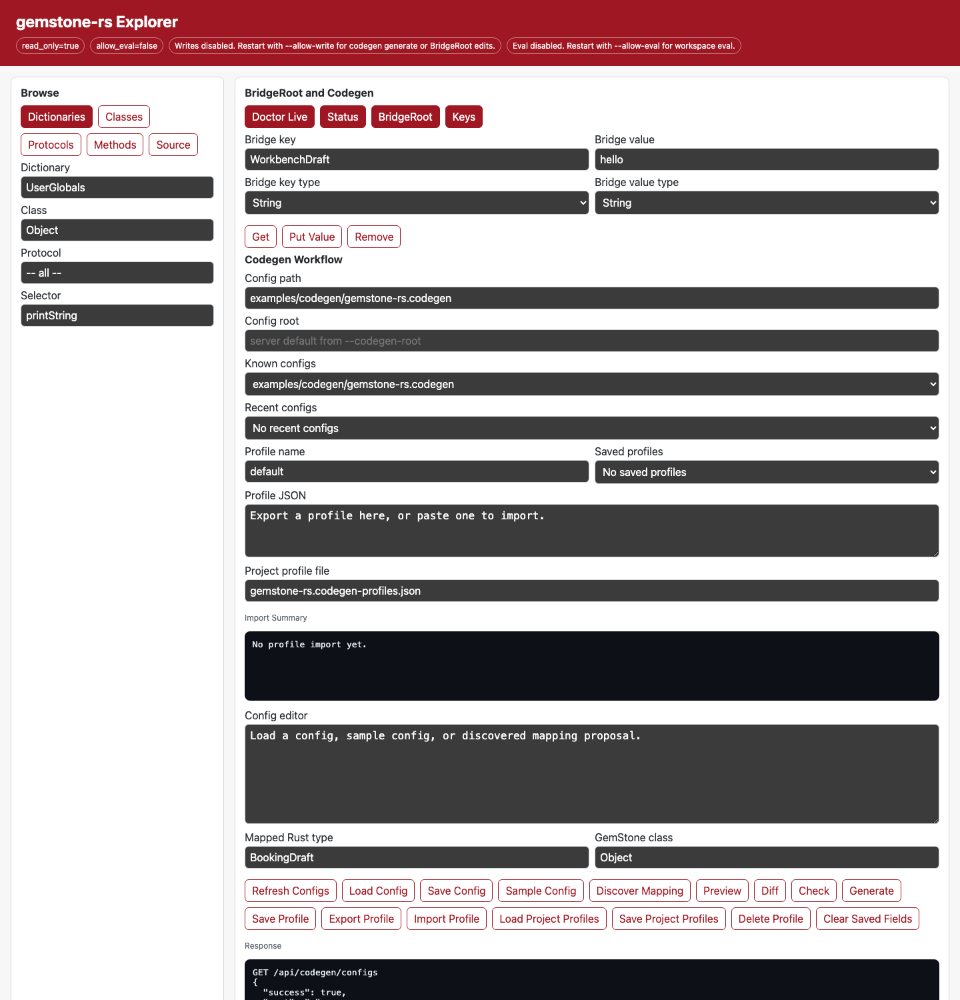

# Explorer Guide

`gemstone-rs-explorer` is a local-only HTTP explorer built on the Rust API. It
is useful for proving the browser, inspect, eval, and codegen surfaces before
embedding richer tooling in VS Code or another frontend.

## Install and Run

```bash
cargo install gemstone-rs-explorer
gemstone-rs-explorer --port 8787
```

From a checkout:

```bash
cargo run -p gemstone-rs-explorer -- --port 8787
```

If you launch the explorer outside the project checkout, point codegen
discovery and relative config paths at the checkout explicitly:

```bash
gemstone-rs-explorer --port 8787 --codegen-root /path/to/gemstone-rs
```

Open:

```text
http://127.0.0.1:8787/
```

The home page is a small browser UI over the same JSON endpoints. It can:

- browse dictionaries, classes, protocols, methods, and source
- run doctor/status checks
- inspect BridgeRoot and list keys
- run codegen sample/discover/preview/diff/check/generate from an editable
  config path
- refresh a picker of known `.codegen` files and load one without typing the
  path by hand
- set a project codegen root through `--codegen-root`, or override it from the
  page before refreshing configs
- reuse recently loaded, saved, previewed, diffed, checked, or generated config
  paths from local browser storage
- save named codegen profiles containing config root, config path, mapped Rust
  type, and GemStone class
- export and import codegen profiles as versioned JSON for sharing between
  browsers or teammates
- load project profile files from the codegen root, and save them back when
  the explorer runs with `--allow-write`
- load and save the selected codegen config file; saving is still gated by
  `--allow-write`, accepts a POST body for larger configs, and validates the
  config before writing
- render generated wrapper source, generated mapping config, colored unified
  diff output, and a side-by-side diff in a dedicated detail pane
- remember the current browser fields locally across reloads
- put/remove BridgeRoot values with explicit string/symbol key policy and
  string/small-int/bool value policy when `--allow-write` is enabled

Screenshot:



Refresh it with:

```bash
make screenshots
```

See [Screenshot Workflow](screenshots.md) for the repeatable capture process.

## Safety Defaults

The explorer:

- binds to `127.0.0.1` by default
- rejects non-loopback hosts
- starts read-only
- requires `--allow-eval` before workspace evaluation
- requires `--allow-write` before codegen writes
- reads GemStone credentials from the same `GS_*` environment as the CLI

Do not expose it publicly without adding authentication and transport security.

## Browse Endpoints

Run these from a second terminal:

```bash
curl -s http://127.0.0.1:8787/health
curl -s http://127.0.0.1:8787/api/config
curl -s http://127.0.0.1:8787/api/doctor
curl -s 'http://127.0.0.1:8787/api/doctor?live=1'
curl -s http://127.0.0.1:8787/api/status
curl -s http://127.0.0.1:8787/api/browse/dictionaries
curl -s 'http://127.0.0.1:8787/api/browse/classes?dictionary=UserGlobals'
curl -s 'http://127.0.0.1:8787/api/browse/protocols?class=Object&meta=0'
curl -s 'http://127.0.0.1:8787/api/browse/methods?class=Object&protocol=--%20all%20--&meta=0'
curl -s 'http://127.0.0.1:8787/api/browse/source?class=Object&selector=printString&meta=0'
curl -s 'http://127.0.0.1:8787/api/inspect?oop=20'
```

Expected shapes:

```json
{"status":"ok"}
{"host":"127.0.0.1","port":8787,"readOnly":true,"allowEval":false}
{"success":true,"environment":{"GS_PASSWORD":{"status":"set","masked":true}}}
{"connected":true,"sessionId":12345,"needsCommit":false,"inTransaction":false}
{"success":true,"dictionaries":["UserGlobals"]}
```

## Eval

Eval is disabled by default:

```bash
gemstone-rs-explorer --allow-eval
```

Then:

```bash
curl -s 'http://127.0.0.1:8787/api/eval?source=3%20%2B%204'
```

Expected:

```json
{"type":"smallInt","value":7}
```

## Codegen Endpoints

The home page includes a Codegen Workflow panel. Set `Config path`, optionally
set `Config root`, or start the server with `--codegen-root`. `Refresh Configs`
and the `Known configs` picker choose an existing `.codegen` file relative to
that root. The `Recent configs` picker remembers paths used by Load, Save,
Preview, Diff, Check, and Generate in local browser storage. `Saved profiles`
store the root, config path, mapped Rust type, and GemStone class as a named
local browser profile. `Export Profile` writes a versioned JSON payload to
`Profile JSON`; paste that JSON into another explorer and use `Import Profile`
to merge it into saved profiles. `Load Project Profiles` reads
`gemstone-rs.codegen-profiles.json` from the codegen root by default, while
`Save Project Profiles` writes the current saved profiles back to that file
when the explorer runs with `--allow-write`. Optionally enter a mapped Rust
type and GemStone class, then use:

- `Config root` to override the server default for config discovery and
  relative config paths
- `Refresh Configs` to scan the project root for known `.codegen` files
- `Recent configs` to return to the last few config paths used in this browser
- `Save Profile` and `Saved profiles` to switch between named codegen workflows
- `Export Profile` and `Import Profile` to share a codegen workflow as JSON
- `Load Project Profiles` and `Save Project Profiles` to use a committed
  project-level profile file; the server rejects invalid profile schemas and
  the browser reports which profiles are new, replaced, or unchanged
- `Load Config` to read the selected config file into the editor
- `Save Config` to POST the editor contents, validate them, and write the file
  when the explorer was started with `--allow-write`
- `Sample Config` to view the starter config format
- `Discover Mapping` to ask a live stone for a mapping config proposal
- `Preview` to inspect generated Rust wrappers without writing files
- `Diff` to compare generated output with the committed file; the detail pane
  shows both the exact unified diff and a side-by-side view for review
- `Check` to fail when generated output is stale
- `Generate` to write wrappers when the explorer was started with
  `--allow-write`

Read-only endpoints:

```bash
curl -s http://127.0.0.1:8787/api/codegen/sample
curl -s 'http://127.0.0.1:8787/api/codegen/configs?root=.'
curl -s 'http://127.0.0.1:8787/api/codegen/profiles?profile_file=gemstone-rs.codegen-profiles.json'
curl -s 'http://127.0.0.1:8787/api/codegen/config?config=examples/codegen/gemstone-rs.codegen'
curl -s 'http://127.0.0.1:8787/api/codegen/preview?config=examples/codegen/gemstone-rs.codegen'
curl -s 'http://127.0.0.1:8787/api/codegen/diff?config=examples/codegen/gemstone-rs.codegen'
curl -s 'http://127.0.0.1:8787/api/codegen/check?config=examples/codegen/gemstone-rs.codegen'
curl -s 'http://127.0.0.1:8787/api/codegen/discover-mapping?mapped=BookingDraft&class=Object'
```

The repository includes a sample project profile file:

```text
examples/codegen/gemstone-rs.codegen-profiles.json
```

Expected read-only results include the config list and a current generated
output check:

```json
{"success":true,"root":".","configs":["examples/codegen/gemstone-rs.codegen"]}
{"success":true,"exists":true,"upToDate":true}
```

Write-gated endpoint:

```bash
gemstone-rs-explorer --allow-write
```

```bash
curl -s 'http://127.0.0.1:8787/api/codegen/generate?config=examples/codegen/gemstone-rs.codegen'
curl -s -X POST \
  --data-binary @gemstone-rs.codegen-profiles.json \
  'http://127.0.0.1:8787/api/codegen/profiles/save?profile_file=gemstone-rs.codegen-profiles.json'
curl -s -X POST \
  --data-binary @examples/codegen/gemstone-rs.codegen \
  'http://127.0.0.1:8787/api/codegen/config/save?config=examples/codegen/draft.codegen'
```

Expected:

```json
{"success":true,"output":"examples/codegen/generated/gemstone_wrappers.rs","bytes":1234}
{"success":true,"config":"examples/codegen/draft.codegen","bytes":512}
```

Project profile files use this shape:

```json
{"kind":"gemstone-rs-explorer-codegen-profiles","version":1,"profiles":[{"name":"default","config":"examples/codegen/gemstone-rs.codegen","root":"","mapped":"BookingDraft","className":"Object"}]}
```

Validate the file before sharing or saving it from CI:

```bash
gemstone-rs profile validate gemstone-rs.codegen-profiles.json
```

The schema reference is [Codegen Profile Schema](profile-schema.md).

For write endpoints, relative `config=` and `profile_file=` paths are resolved
inside the codegen root. Paths containing `..` are rejected after URL decoding,
`root=...` traversal is rejected as well, and absolute write paths require
starting the explorer with `--allow-absolute-write-paths`.

Project profile saves validate the JSON before writing. The top-level object
must contain only `kind`, `version`, and `profiles`; profile names are required
and unique; and each profile may contain only string-valued `name`, `config`,
`root`, `mapped`, and `className` fields.

## BridgeRoot Endpoints

BridgeRoot inspection and mapping-config preview use the same live session
configuration as the browser endpoints:

```bash
curl -s http://127.0.0.1:8787/api/bridge/root
curl -s http://127.0.0.1:8787/api/bridge/keys
curl -s 'http://127.0.0.1:8787/api/bridge/get?key=BookingDraft'
curl -s 'http://127.0.0.1:8787/api/bridge/get?key=BookingDraft&key_type=Symbol'
curl -s 'http://127.0.0.1:8787/api/bridge/mapping-config?mapped=BookingDraft'
```

The browser UI exposes `Bridge key type` and `Bridge value type` controls so
you can explicitly test string-key, symbol-key, string-value, small-int-value,
and bool-value mappings before encoding them in a reusable config file. It
persists the selected key, value, class, selector, config, and mapping fields in
browser local storage; use `Clear Saved Fields` to reset the page back to the
documented defaults.

Writes are disabled unless the explorer is started with `--allow-write`:

```bash
gemstone-rs-explorer --allow-write
curl -s 'http://127.0.0.1:8787/api/bridge/put?key=WorkbenchDraft&value=hello'
curl -s 'http://127.0.0.1:8787/api/bridge/put?key=WorkbenchCount&value=7&value_type=SmallInt'
curl -s 'http://127.0.0.1:8787/api/bridge/put?key=WorkbenchApproved&value=true&value_type=Bool'
curl -s 'http://127.0.0.1:8787/api/bridge/remove?key=WorkbenchDraft'
```

Expected shapes:

```json
{"success":true,"name":"GemStoneRsBridgeRoot","oop":1234,"identityId":1}
{"success":true,"root":"GemStoneRsBridgeRoot","keys":[{"printString":"BookingDraft"}]}
{"oop":5678,"classOop":9012,"printString":"aDictionary(...)"}
{"success":true,"config":"mapped = BookingDraft ..."}
{"success":true,"root":"GemStoneRsBridgeRoot","key":"WorkbenchDraft","keyType":"String","valueType":"String","oop":3456}
```

## Product Direction

The explorer should remain a separate binary crate. The core `gemstone-rs`
library stays focused on safe GemStone API access, while the explorer proves
higher-level browsing and codegen workflows.

Good next steps:

- short GIFs showing profile import, codegen preview, and BridgeRoot checks
- deeper VS Code webview integration
