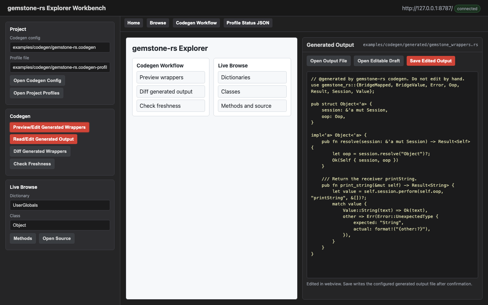

# VS Code Workbench

`gemstone-rs Workbench` is the VS Code companion for the Rust CLI and local
explorer. It keeps the CLI as the stable contract and adds a sidebar, output
panel, generated-file previews, and codegen diff prompts.

Marketplace:

```text
https://marketplace.visualstudio.com/items?itemName=unicompute.gemstone-rs-workbench
```



## Setup

For installed CLI tools:

```json
{
  "gemstoneRs.cliPath": "gemstone-rs",
  "gemstoneRs.explorerPath": "gemstone-rs-explorer",
  "gemstoneRs.codegenConfig": "gemstone-rs.codegen",
  "gemstoneRs.bridgeRoot": "GemStoneRsBridgeRoot"
}
```

For a source checkout:

```json
{
  "gemstoneRs.checkoutPath": "/path/to/gemstone-rs",
  "gemstoneRs.useCargo": true,
  "gemstoneRs.codegenConfig": "examples/codegen/gemstone-rs.codegen",
  "gemstoneRs.bridgeRoot": "GemStoneRsBridgeRoot"
}
```

Use the same `GS_*` environment as the CLI.

## Sidebar Tree

Open the GemStone RS activity bar item.

The sidebar contains:

- `Dictionaries`
- `Codegen Config`
- `Explorer`

`Dictionaries` expands live dictionaries, classes, protocols, and methods.
Selecting a method opens its source in an untitled Smalltalk editor.

`Codegen Config` exposes:

- Discover from Live Stone
- BridgeRoot name from `gemstoneRs.bridgeRoot`
- Generate Mapping Config
- Preview BridgeRoot
- List BridgeRoot Keys
- Put BridgeRoot String
- Put BridgeRoot Symbol
- Put BridgeRoot SmallInt
- Put BridgeRoot Bool
- Remove BridgeRoot Key
- Run Generated Mapping Example
- Preview Wrappers
- Diff Generated Output
- Check Freshness
- Generate Wrappers
- Load Project Profiles
- Save Project Profiles
- Export Codegen Profile
- Show Sample Project Profiles
- Create Project Profiles
- Validate Project Profiles
- List Project Profiles
- Show Project Profile
- Resolve Project Profile
- Check Project Profiles
- Open Codegen Docs

`Explorer` exposes:

- Doctor
- Verify Setup
- Verify Live Setup
- Eval Smalltalk
- Show Example Commands
- Generate Explorer Auth Token
- Clear Explorer Auth Token
- Launch Explorer
- Open Explorer Webview

`Comparison` exposes:

- Compare with gemstone-py
- Show All Comparison Status

## Command Palette

Commands:

- `GemStone RS: Verify Setup`
- `GemStone RS: Verify Live Setup`
- `GemStone RS: Verify Strict Setup`
- `GemStone RS: Doctor`
- `GemStone RS: Show Environment Template`
- `GemStone RS: Copy Environment Template`
- `GemStone RS: Write .env.gemstone-rs`
- `GemStone RS: Eval Smalltalk`
- `GemStone RS: Browse Dictionaries`
- `GemStone RS: Browse Classes`
- `GemStone RS: Show Example Commands`
- `GemStone RS: Codegen Init`
- `GemStone RS: Codegen Discover`
- `GemStone RS: Generate Mapping Config`
- `GemStone RS: Preview BridgeRoot`
- `GemStone RS: List BridgeRoot Keys`
- `GemStone RS: Put BridgeRoot String`
- `GemStone RS: Put BridgeRoot Symbol`
- `GemStone RS: Put BridgeRoot SmallInt`
- `GemStone RS: Put BridgeRoot Bool`
- `GemStone RS: Remove BridgeRoot Key`
- `GemStone RS: Run Generated Mapping Example`
- `GemStone RS: Codegen Preview`
- `GemStone RS: Codegen Diff`
- `GemStone RS: Codegen Check`
- `GemStone RS: Codegen Explain`
- `GemStone RS: Codegen Generate`
- `GemStone RS: Codegen Preview Profile`
- `GemStone RS: Codegen Diff Profile`
- `GemStone RS: Codegen Check Profile`
- `GemStone RS: Codegen Explain Profile`
- `GemStone RS: Codegen Generate Profile`
- `GemStone RS: Load Project Profiles`
- `GemStone RS: Save Project Profiles`
- `GemStone RS: Export Codegen Profile`
- `GemStone RS: Show Sample Project Profiles`
- `GemStone RS: Create Project Profiles`
- `GemStone RS: Validate Project Profiles`
- `GemStone RS: List Project Profiles`
- `GemStone RS: Show Project Profile`
- `GemStone RS: Resolve Project Profile`
- `GemStone RS: Check Project Profiles`
- `GemStone RS: Generate Explorer Auth Token`
- `GemStone RS: Clear Explorer Auth Token`
- `GemStone RS: Launch Explorer`
- `GemStone RS: Open Explorer Webview`
- `GemStone RS: Open Method Source`
- `GemStone RS: Open Codegen Docs`
- `GemStone RS: Validate py-native Contract`
- `GemStone RS: Validate py-native Samples Fixture`
- `GemStone RS: Validate py-native Smoke Fixture`
- `GemStone RS: Run py-native Smoke`
- `GemStone RS: Show py-native Migration Plan`
- `GemStone RS: Compare with gemstone-py`
- `GemStone RS: Show All Comparison Status`

`GemStone RS: Verify Setup` and `GemStone RS: Doctor` both run the CLI
`gemstone-rs doctor` report, so the workbench setup view and terminal setup
use the same diagnostic path. `GemStone RS: Verify Live Setup` runs
`gemstone-rs doctor --live` when credentials and a reachable stone are
available. `GemStone RS: Verify Strict Setup` runs `gemstone-rs doctor
--strict` for CI-style validation of explicit stone and GCI library settings.
All setup checks add the active checkout, CLI, explorer, codegen config, and
profile paths, plus whether the configured `gemstoneRs.envFile` exists. When
that file exists, Workbench passes `--env-file` automatically to CLI commands
and explorer startup. The report also includes the configured BridgeRoot name
used by BridgeRoot commands and explorer probes. The checks offer result
actions to copy the full report, copy a safe `GS_*` environment export script
with a placeholder password, or open the extension settings.

`GemStone RS: Run Setup Assistant` calls the running local explorer at
`/api/setup/assistant` and renders the structured env-file, GemStone
configuration, GCI library, codegen config, and project profile checks in the
output panel. Start the explorer first with `GemStone RS: Launch Explorer`.

`GemStone RS: Show Environment Template`, `GemStone RS: Copy Environment
Template`, and `GemStone RS: Write .env.gemstone-rs` call the CLI
`gemstone-rs env sample/write` commands. The template uses current non-secret
values when available and keeps passwords as placeholders.

`GemStone RS: Show Example Commands` calls `gemstone-rs examples list --json`,
renders the installed CLI example index, and lets you run a selected Cargo
example in a terminal, copy its command, or open the examples guide. This
closes one gemstone-py parity gap: gemstone-rs now has a CLI and editor
example launcher instead of only Markdown tables. The matching terminal
command is also available as `gemstone-rs examples run <name>` from a source
checkout.

## Codegen Workflow

1. Set `gemstoneRs.codegenConfig`.
2. Run `GemStone RS: Codegen Discover` or edit the config manually.
3. Run `GemStone RS: Codegen Preview`.
4. Run `GemStone RS: Codegen Diff`.
5. Run `GemStone RS: Codegen Explain`.
6. Run `GemStone RS: Open Codegen Config` or `GemStone RS: Open Project Profiles`
   when you want to edit configured files in VS Code.
7. Run `GemStone RS: Validate py-native Contract` when you want to confirm the
   checked-in Rust adapter contract for `gemstone-py-native`.
8. Run `GemStone RS: Validate py-native Samples Fixture` when you want to
   confirm the checked-in value/error payload examples for wrapper tests.
9. Run `GemStone RS: Validate py-native Smoke Fixture` when you want to confirm
   the checked-in dry-run smoke report for adapter consumers.
10. Run `GemStone RS: Run py-native Smoke` when you want adapter smoke checks
   from VS Code.
11. Run `GemStone RS: Show py-native Migration Plan` when you want the
   remaining `gemstone-py-native` shared-core checklist.
12. Run `GemStone RS: Open Generated Output`.
13. Run `GemStone RS: Codegen Generate`.

`Codegen Generate` runs the diff first. If output would change, it opens the
diff and asks before writing.

`Codegen Explain` runs `codegen explain --json` and renders the output path,
generated test stubs, wrapper classes, selectors, return types, and
BridgeRoot mappings in the output panel. Result actions can copy the summary,
copy the raw JSON, open the JSON in an editor, or open the config file.
`Open Codegen Config` and `Open Project Profiles` open the configured files
directly from settings, which is useful from the webview and command palette.
`Open Generated Output` uses the same structured explain output to open the
current generated wrapper file directly.
`Validate py-native Contract` runs
`gemstone-rs py-native check --json` against `gemstoneRs.pyNativeFixture`, then
renders the path, status, and contract version in the output panel with actions
to copy the report or open the fixture. `Validate py-native Samples Fixture`
runs `gemstone-rs py-native check-samples --json` against
`gemstoneRs.pyNativeSamplesFixture`, then renders the fixture freshness,
value count, and error count. `Validate py-native Smoke Fixture` runs
`gemstone-rs py-native check-smoke --json` against
`gemstoneRs.pyNativeSmokeFixture`, then renders the same fixture freshness view
for the dry-run adapter smoke report. `Run py-native Smoke` runs
`gemstone-rs py-native smoke --json`, prompts for dry-run or live mode, and shows
every adapter step with copyable output. `Show py-native Migration Plan` runs
`gemstone-rs py-native migration --json` and renders the current
`gemstone-py-native` wrapper migration checklist.

Inside `GemStone RS: Open Explorer Webview`, the Codegen buttons use the same
config/profile settings but keep the review loop in one pane. `Preview/Edit
Generated Wrappers`, `Read/Edit Generated Output`, `Preview/Edit Profile`, and
`Read/Edit Profile Output` render generated Rust source in an editable webview
textarea. From there you can:

- open the configured generated output file in a normal VS Code editor
- open the current webview text as an untitled editable draft
- save the edited text back to the generated output file after a confirmation

The save handler refuses paths outside `gemstoneRs.checkoutPath` or the active
workspace, so an accidental config path cannot overwrite files elsewhere on the
machine.

When a project profile file is checked in, use the profile variants instead:
`Codegen Preview Profile`, `Codegen Diff Profile`, `Codegen Check Profile`,
`Codegen Explain Profile`, and `Codegen Generate Profile`. They prompt for a
profile name and `gemstone-rs.codegen-profiles.json`, resolve the profile's
config/root fields, and then run the same codegen operation.

## Object Mapping Workflow

Use `GemStone RS: Generate Mapping Config` when you want the live stone to
inspect a GemStone class and propose a `BridgeMapped` config. The command asks
for:

- config path
- Rust struct name
- GemStone class reference, such as `Object` or `UserGlobals:OkzBooking`

Use `GemStone RS: Preview BridgeRoot` after starting the local explorer. It
opens:

```text
http://127.0.0.1:8787/api/bridge/root?root=GemStoneRsBridgeRoot
```

Use the embedded explorer's `BridgeRoot Value` action when you want the richer
view. The response includes the raw OOP/class/printString summary and a nested
`BridgeValue` tree, so dictionaries, arrays, symbol values, and depth-limited
object references are visible before you settle on a generated mapping.
Use `Shape Report` to turn that tree into relationship paths, node kinds, key
policy, nil counts, opaque OOP counts, report-local identity ids, and repeated
object references.
Use `Preview Mapping Config` in that same BridgeRoot panel to infer a starter
`BridgeMapped` codegen config from the selected live value before saving it to
the project.

Use `GemStone RS: List BridgeRoot Keys` for the same inspection path without
opening a browser; it runs `gemstone-rs bridge keys --root <bridge-root>` and
writes the key OOPs, class OOPs, `printString` values, and identity ids to the
output panel.

Set `gemstoneRs.bridgeRoot` when a project uses a custom bridge dictionary
global. The workbench passes that value to CLI commands as `--root` and to the
explorer API as the `root=` query parameter.

Use `GemStone RS: Put BridgeRoot String` when you want a quick live-write smoke
test from VS Code. It asks for a key, whether that key is a String or Symbol,
and a string value, then runs:

```bash
gemstone-rs bridge put-string <key> <value> --key-type String --root GemStoneRsBridgeRoot
```

Use `GemStone RS: Put BridgeRoot Symbol` for the same workflow when the stored
value should be a GemStone Symbol:

```bash
gemstone-rs bridge put-symbol <key> <value> --key-type String --root GemStoneRsBridgeRoot
```

Use `GemStone RS: Put BridgeRoot SmallInt` or `GemStone RS: Put BridgeRoot
Bool` when the stored value should be a GemStone SmallInteger or Boolean:

```bash
gemstone-rs bridge put-smallint <key> <value> --key-type String --root GemStoneRsBridgeRoot
gemstone-rs bridge put-bool <key> <value> --key-type String --root GemStoneRsBridgeRoot
```

Use `GemStone RS: Remove BridgeRoot Key` to remove one BridgeRoot key after a
String/Symbol key-type prompt and confirmation prompt:

```bash
gemstone-rs bridge remove <key> --key-type String --root GemStoneRsBridgeRoot
```

Use `GemStone RS: Run Generated Mapping Example` to run:

```bash
cargo run -p gemstone-rs --example generated_mapping_app
```

## Embedded Explorer Webview

Use `GemStone RS: Launch Explorer` first. It starts `gemstone-rs-explorer` in a
terminal and opens the browser. Then use `GemStone RS: Open Explorer Webview`
to embed the local explorer inside VS Code.

The webview points at:

```text
http://127.0.0.1:8787/
```

If you set `gemstoneRs.explorerAuthToken`, `GemStone RS: Launch Explorer`
starts the server with `--auth-token-env GEMSTONE_RS_EXPLORER_TOKEN` so the
token is not printed in the terminal command. Browser and webview URLs include
the matching `token=` query parameter. Use `GemStone RS: Generate Explorer Auth
Token` to create a local random token, save it to VS Code settings, and copy it
to the clipboard. Use `GemStone RS: Clear Explorer Auth Token` to return to the
default loopback-only, no-token mode.

It is still the same loopback-only explorer process. If the explorer is not
running, the webview will show a connection error and the output panel will show
the URL to start.

The embedded page now acts as the main IDE surface for the local explorer. The
iframe remains the full browser UI, while the side inspector renders structured
setup checks, live dictionary/class/protocol/method browsing, method source
previews, project profile freshness tables with Preview/Diff/Check/Generate
buttons, Codegen explain summaries, generated source, colorized diffs,
BridgeRoot identity, key, and value summaries, and comparison status cards. The
same shell can hand off to native VS Code commands for generated wrapper
preview, diff, check, opening config/profile/generated files, editing generated
source in the webview, saving edited generated output with confirmation,
generate-with-confirmation, profile checks, docs, and opening the last generated
output file reported by the explorer. If the explorer is not running, the
webview prompts with Launch Explorer, Open Browser, and Copy URL fallback
actions.

The webview also exposes comparison status commands. `Compare with gemstone-py`
runs `gemstone-rs compare gemstone-py --status --json` and renders the answer,
parity score, remaining batch count, next batch, top gap, and follow-up CLI
commands in the GemStone RS output panel. `Show All Comparison Status` renders
the aggregate status for every comparison target, including the combined
batch/hour estimate.

The explorer page can load and save the selected codegen config file,
posting the editor contents as the request body; saves still require the
explorer to run with `--allow-write`. Use `Refresh Configs` in the embedded
page to populate the `Known configs` picker from the explorer process working
tree, or set `Config root` in the page when the explorer was launched from a
different directory. The page also keeps a local `Recent configs` picker for
paths used by Load, Save, Preview, Diff, Check, and Generate. Use `Save
Profile` when you want to switch between named codegen workflows; a profile
stores the config root, config path, mapped Rust type, and GemStone class in
local browser storage. `Export Profile` writes a JSON payload into `Profile
JSON`, and `Import Profile` merges pasted profile JSON from another browser or
teammate. `Load Project Profiles` reads `gemstone-rs.codegen-profiles.json`
from the configured codegen root, and `Save Project Profiles` writes the saved
profile list back when the explorer was launched with `--allow-write`. Project
profile payloads are schema-validated before writing, and imports report which
profiles are new, replaced, or unchanged. It remembers its current fields
locally, so repeated codegen or BridgeRoot checks keep the same config path and
class selection.

Use `GemStone RS: Show Sample Project Profiles` to open the built-in sample
from `gemstone-rs profile sample`, `GemStone RS: Create Project Profiles` to
write that sample into a project file with `gemstone-rs profile init`, and
`GemStone RS: Validate Project Profiles` when you want a direct CLI check
without opening the explorer. Validation runs `gemstone-rs profile validate`
against the selected profile file and writes the result to the GemStone RS
output panel. `GemStone RS: List Project Profiles` and `GemStone RS: Show
Project Profile` run `gemstone-rs profile list/show` and render the parsed
config/root/mapped/class fields in the same output panel. `GemStone RS:
Resolve Project Profile` runs `gemstone-rs profile resolve` and shows the
config path that profile-driven codegen will use. `GemStone RS: Check Project
Profiles` runs `gemstone-rs profile check --json` across every profile and
renders an aggregate summary with ok, stale, and error counts before you
commit. The result message can copy the report or open the profile file for
quick repair. Profile-specific commands use a QuickPick populated from the
project profile file. The extension also contributes JSON validation for files named
`gemstone-rs.codegen-profiles.json` and profile check reports named
`gemstone-rs.profile-check.json`.

## Develop the Extension

```bash
cd vscode-gemstone-rs-workbench
npm ci
npm run check
npm run test:smoke
npm run package -- --out gemstone-rs-workbench-0.3.4.vsix
```

From the repository root:

```bash
make vscode-package
```

## Later Feature Work

The embedded webview now covers the main Codegen, profile, setup, comparison,
generated-output editing, BridgeRoot inspection, live browsing, source preview,
open-file loops, nested BridgeValue rendering, and committed Marketplace/GitHub
visual assets. Shape reports now also show repeated OOP identity groups, so
users can see every relationship path pointing at the same GemStone object.
Next polish should focus on deeper generated-file editing flows and richer live
object navigation.
